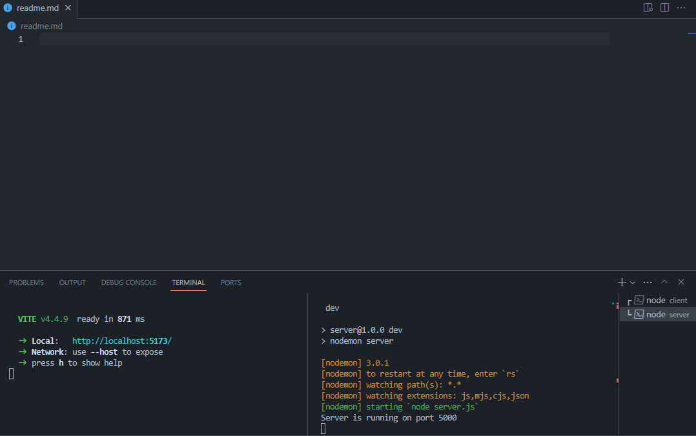

# WallpaperFlare API and Search App

A web application using vite,react and nodejs that allows users to search for wallpaper using keywords and set the number of images to display.

A preview of the **App** :


A preview of the **API** : 


## Table of Contents

- [Getting Started](#getting-started)
- [Usage](#usage)

## Getting Started

To get started with the Wallpaperflare Search App, follow these steps:

1. Clone the repository:

    ```bash
    git clone https://github.com/amineboucenna/wallpaperflare-search-app.git
    cd wallpaperflare-search-app
    ```

2. Install the project dependencies:

    ```bash
    cd server
    npm install
    cd ..
    cd client
    npm install
    ```

## Usage

Open 2 terminals and do the following: 

1. In the **first** terminal:

    ```bash
    cd server
    npm run
    ```
    for developpement and debuggin you can use the following:

    ```bash
    cd server
    npm i nodemon -D
    npm run dev 
    ```

2. In the **second** terminal:

    ```bash
    cd client
    npm run dev
    ```

3. for the **API** visit this link in your **web browser**
    
    ```bash
    http://localhost:5000/api/
    ```

    for the **App** visit

    ```bash
    http://localhost:5000
    ```

Here is an installation example


